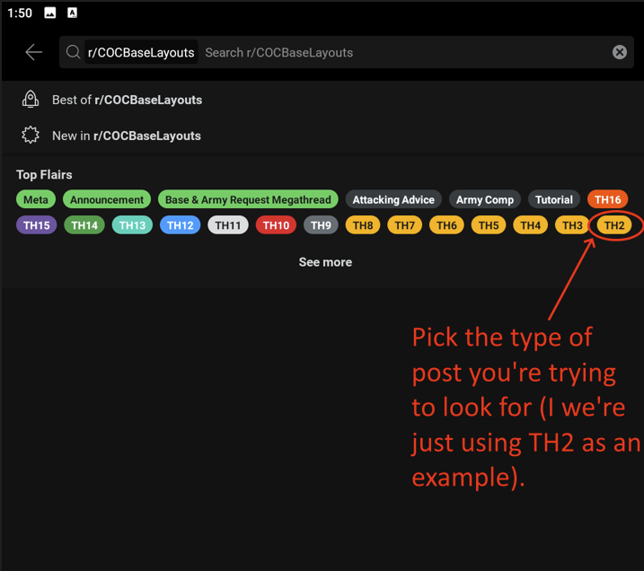
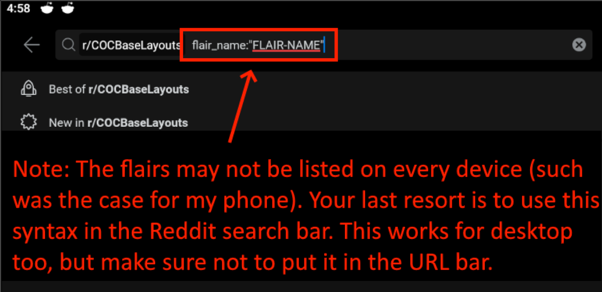
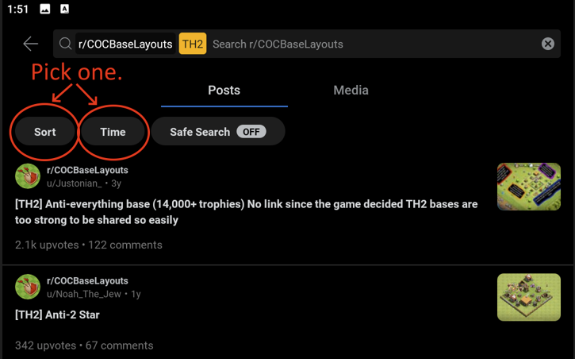
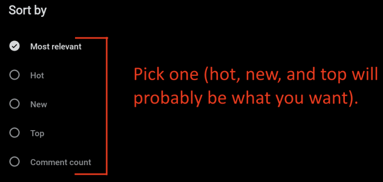
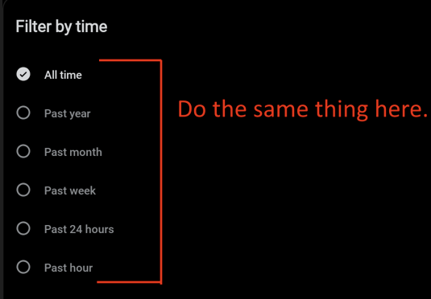
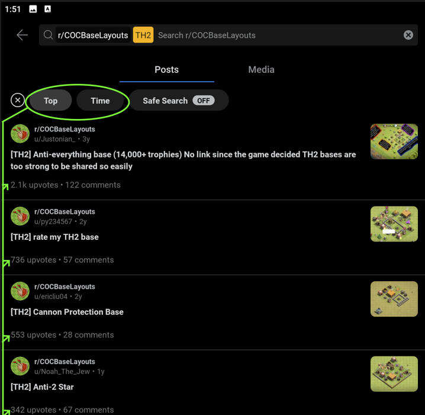
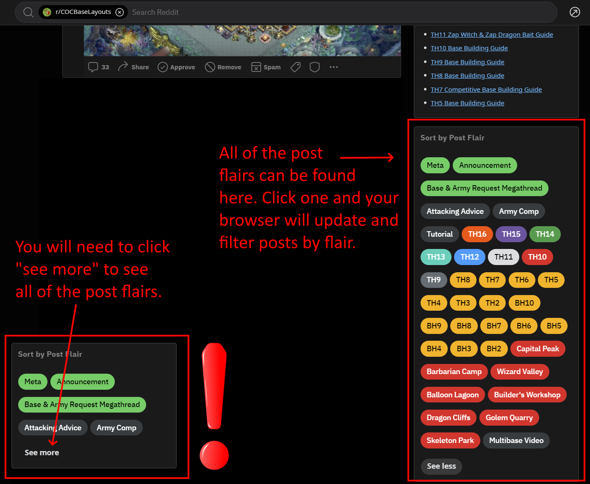
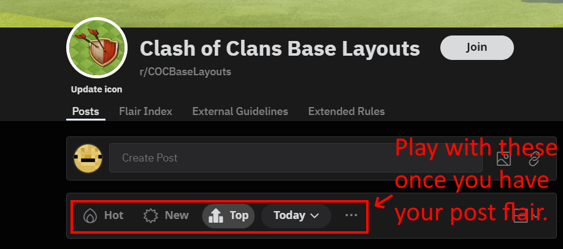

# Table of Contents
1. [Overview](#overview)
2. [Using Filters on Mobile](#using-filters-on-mobile)
3. [Using Filters on Desktop](#using-filters-on-desktop)

## Overview
This is a brief article that aims to teach users how to use flairs and filters (hot, new, top, time, year, month, etc.) to better bases that meet your particular TH/BH level. Please make a genuine attempt to follow the guide and learn something from it. If you need further help, feel free to contact [modmail](https://www.reddit.com/message/compose?to=%2Fr%2Fcocbaselayouts) if you need any further help.

## Using Filters on Mobile

Note: I'm using an android for this tutorial. iPhone should be a very similar experience.
First, we start at [r/COCBaseLayouts](https://www.reddit.com/r/COCBaseLayouts/). Next, we open the search menu.

-----
-----

Next, we filter the posts by flair first. Pick whatever flair you want to filter (we're using TH2 as an example). If this isn't visible, continue reading.

-----
-----

On some devices, you may not see a list of the post flairs like you can on this particular android. Your final solution is to lookup the flair in the search bar.

We're still figuring out the exact syntax. On (my) android, the following syntax is: `flair_name:"FLAIR-NAME"`.

On iOS, the syntax is `flair:"FLAIR-NAME"`.

In either case, this works on mobile and desktop, so long as you use the search bar built into the Reddit website, NOT the URL bar.

-----
-----

Then, we want to use the Reddit filters. We can sort the posts by age, total upvotes, popularity (hot) or time-based filters such as past hour, day, week, etc.

-----
-----

These are your sort options.

-----
-----

And these are your time options.

-----
-----

And as you can see, we gathered all of the TH2 posts, and sorted them by total upvotes (top) of all time!

-----
-----

## Using Filters on Desktop
Like mobile, we want to filter by flair first. There's a few ways of doing this.

If a user has made a post whose type is the same that you're looking to filter by, you can just click the flair of the post!

-----
-----

If that's not possible, the alternative isn't hard either! Just scroll down a tiny bit until you see **"Sort by Post Flair."** Click on **"See more."** This will open up all of the post flairs available on the subreddit.

-----
-----

Just like on mobile, now we want to apply our Reddit filters. This is also pretty straightforward.

-----
-----

Once you've done that, you should your query is filtering content by flairs and the standard filtered Reddit provides us!

As I said before, please make a genuine attempt to follow the guide and learn something from it. If you need further help, feel free to contact [modmail](https://www.reddit.com/message/compose?to=%2Fr%2Fcocbaselayouts) if you need any further help.

Hope this helps! :)
